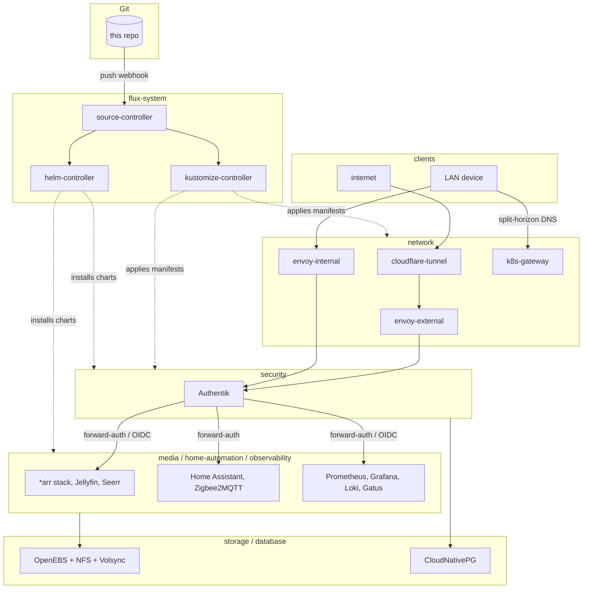

# home-ops

A single-node [Talos Linux](https://github.com/siderolabs/talos) Kubernetes
cluster running a real homelab: a media stack, home automation, and a full
observability/alerting pipeline, all managed declaratively through
[Flux](https://github.com/fluxcd/flux2).

Built from **[onedr0p/cluster-template](https://github.com/onedr0p/cluster-template)**
— the scaffolding (`makejinja` + `pydantic` templating from a single
`cluster.toml`, the Talos/Flux/SOPS bootstrap flow, the `just` task runner)
is entirely his work. Everything below this point describes what was built
on top of it. If you're looking to build your own cluster rather than read
about this one, start there instead.

## Architecture

Single control-plane node (no HA — deliberate, not an oversight: a reboot or
upgrade is a full outage, accepted in exchange for skipping a
replicated-storage tier and a SQLite→Postgres migration every stateful app
would otherwise have needed). Everything below runs on that one node.



`HTTPRoute.parentRefs` on each app is the _entire_ mechanism deciding
LAN-only vs. public — there's no other gate at the network layer. Public
apps route through `envoy-external`, which Cloudflare Tunnel reaches with no
inbound port-forwarding and no home IP exposed; LAN-only apps route through
`envoy-internal`, reachable via split-horizon DNS (`k8s-gateway` answers for
any hostname with an `HTTPRoute`) or over WireGuard from off the LAN.
Authentik sits in front of either gateway: forward-auth (an Envoy
`SecurityPolicy` calling its embedded outpost) for apps with no login of
their own, native OIDC for apps that support it, namespace-scoped access
groups either way.

For example: `sonarr.${SECRET_DOMAIN}` sits on `envoy-internal`, gated by an
Authentik forward-auth `SecurityPolicy` bound to a `media` access group;
`status.${SECRET_DOMAIN}` (Gatus) sits on `envoy-external`, public, behind
the same forward-auth mechanism instead of being left open; `stream.${SECRET_DOMAIN}`
(Jellyfin) is public with no Authentik in front at all — it has its own
account system, so forward-auth would just be a second login. Which pattern
an app gets is a one-line `parentRefs` choice plus, where needed, one
`SecurityPolicy` file living in that app's own directory.

### What's running, by namespace

| Namespace         | Apps                                                                                                                |
| ----------------- | ------------------------------------------------------------------------------------------------------------------- |
| `network`         | Cilium (CNI), Envoy Gateway, k8s-gateway (DNS), cloudflare-tunnel, external-dns                                     |
| `security`        | Authentik, External Secrets Operator, 1Password Connect                                                             |
| `database`        | CloudNativePG — one Postgres instance, used only by Authentik                                                       |
| `storage`         | OpenEBS LocalPV (node NVMe, default StorageClass), csi-driver-nfs, Volsync (restic backups), snapshot-controller    |
| `media`           | Sonarr, Radarr, Prowlarr, Bazarr, SABnzbd, Jellyfin, Seerr, Configarr                                               |
| `home-automation` | Home Assistant, Zigbee2MQTT, Mosquitto                                                                              |
| `observability`   | kube-prometheus-stack (Prometheus/Grafana/Alertmanager), Loki + Alloy, Gatus, Headlamp, an Alertmanager→ntfy bridge |
| `flux-system`     | flux-operator, flux-instance and the four GitOps Toolkit controllers                                                |

Every other app keeps SQLite on local NVMe rather than migrating to
Postgres — it performs well on NVMe and avoids a migration that buys
nothing here. Secrets: SOPS + age for everything needed at bootstrap (the
reason this repo is safe to make public at all), External Secrets Operator

- 1Password layered on afterward for application-level secrets.

## Automation

**Renovate** watches every chart, image, GitHub Action and CLI tool pinned
in this repo and opens PRs (dashboard issue: look for "Renovate Dashboard"
under Issues). Patch and digest updates auto-merge once the CI check below
passes; everything else needs a manual look — except node-level components
(Talos, kubelet) and Authentik, which never auto-merge regardless of update
type, since either one failing badly means a full outage or a broken login
respectively.

**Flate** runs on every PR touching `kubernetes/**`, rendering the whole
Flux Kustomization tree through Helm and validating the output — the gate
Renovate's automerge relies on. It catches build-time breakage; it can't
catch an app that applies cleanly but misbehaves at runtime, which is what
the cluster's own alerting (Alertmanager + Gatus, both → ntfy, plus a
dead-man's-switch heartbeat so _losing_ the node is also detected) is for.

## Debugging

1. Are the Flux resources up to date and Ready?

    ```sh
    flux get sources git -A
    flux get ks -A
    flux get hr -A
    ```

2. Is the pod there?

    ```sh
    kubectl -n <namespace> get pods -o wide
    ```

3. What do its logs say?

    ```sh
    kubectl -n <namespace> logs <pod-name> -f
    ```

4. What does describing the resource show?

    ```sh
    kubectl -n <namespace> describe <resource> <name>
    ```

5. What do the namespace's events say?

    ```sh
    kubectl -n <namespace> get events --sort-by='.metadata.creationTimestamp'
    ```

## Maintenance

```sh
# Preview rendered machine configs, then apply a config change to a node
just talos render
just talos apply-node <node>

# Upgrade Talos itself, or the Kubernetes version
just talos upgrade-node <node>
just talos upgrade-k8s
```

## Thanks

This started as [onedr0p/cluster-template](https://github.com/onedr0p/cluster-template)
and still runs on its bootstrap flow — `makejinja`, `pydantic`, `topf`,
`just`, the SOPS/Flux wiring. Thanks to onedr0p and every contributor to
that project for making a real GitOps homelab this approachable to stand
up. Community support for the template itself lives in its own
[Discussions](https://github.com/onedr0p/cluster-template/discussions) and
the [Home Operations](https://discord.gg/home-operations) Discord.
